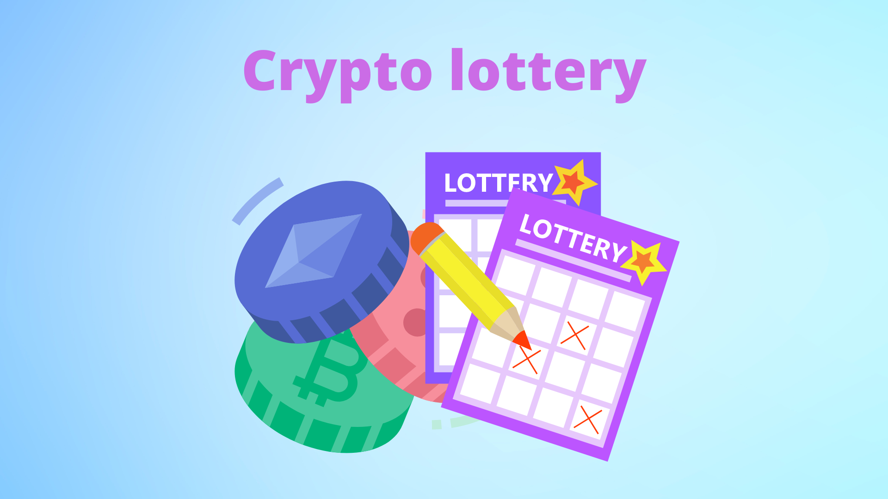

# Foundry Lottery Project



## Overview
The Foundry Lottery project is a decentralized smart contract-based raffle system. Participants can enter the lottery by sending a specified amount of ETH. A winner is selected at regular intervals using Chainlink VRF (Verifiable Random Function) for fair and transparent randomness.

## Features
- Users can enter the lottery by sending ETH.
- A winner is chosen using Chainlink VRF.
- The contract ensures fair execution with automated upkeep.
- Utilizes Chainlink Automation for scheduled execution.
- Implements error handling to ensure a smooth process.

## Prerequisites
Before you begin, ensure you have the following installed:
- [Foundry](https://github.com/foundry-rs/foundry) for Solidity development and testing.
- Node.js & npm (optional, for additional tooling and dependencies).
- An Ethereum wallet like MetaMask.
- Access to a testnet (e.g., Sepolia, Goerli) and an RPC provider like Alchemy or Infura.
- Chainlink VRF subscription for random number generation.

## Installation
1. Clone the repository:
   ```sh
   git clone <repository-url>
   cd foundry-lottery
   ```
2. Install dependencies:
   ```sh
   forge install
   ```

## Compilation
To compile the contract, run:
```sh
forge build
```

## Deployment
Deploy the contract using Foundry:
```sh
forge create --rpc-url <YOUR_RPC_URL> --private-key <YOUR_PRIVATE_KEY> src/Raffle.sol:Raffle --constructor-args <SUBSCRIPTION_ID> <GAS_LANE> <INTERVAL> <ENTRANCE_FEE> <CALLBACK_GAS_LIMIT> <VRF_COORDINATOR>
```
Replace the placeholders with your actual values.

## Interacting with the Contract
After deployment, interact using `cast` commands:
- **Enter the lottery:**
  ```sh
  cast send <CONTRACT_ADDRESS> "enterRaffle()" --value <ENTRANCE_FEE> --private-key <YOUR_PRIVATE_KEY>
  ```
- **Check contract state:**
  ```sh
  cast call <CONTRACT_ADDRESS> "getRaffleState()"
  ```
- **Get recent winner:**
  ```sh
  cast call <CONTRACT_ADDRESS> "getRecentWinner()"
  ```

## Testing
Run the tests with:
```sh
forge test
```
Ensure you have a `.env` file configured for private keys and RPC URLs if required.

## Security Considerations
- Ensure the contract is deployed on a secure and trusted network.
- Use only verified sources for Chainlink VRF and Automation.
- Always test on a testnet before deploying to mainnet.

